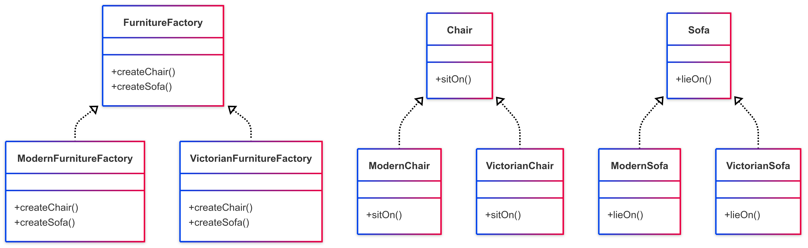

# 🧱 Abstract Factory Pattern

## 📘 Problem Statement

Imagine you're developing a furniture shop simulator. You offer several types of furniture — `Chair`, `Sofa`, and `CoffeeTable` — each available in different styles like `Modern`, `Victorian`, and `ArtDeco`.

You want to ensure that when a customer picks a furniture style, all pieces (chair, sofa, table) come from the **same style family** — no mismatched sets.

How can you create **families of related products** without coupling the code to specific variants? You also want to support future styles without modifying existing logic.

---

## ✅ Solution

The **Abstract Factory** pattern allows you to create families of related objects (`Chair`, `Sofa`, `CoffeeTable`) without specifying their concrete classes.

1. Define **abstract product interfaces** for each type (e.g., `Chair`, `Sofa`).
2. Implement **concrete product classes** for each style variant.
3. Create an **abstract factory interface** that declares methods like `createChair()`, `createSofa()`.
4. Implement **concrete factories** for each style (e.g., `ModernFurnitureFactory`, `VictorianFurnitureFactory`).
5. The client uses the factory interface and never needs to know the concrete implementations.

This ensures that all furniture objects belong to the same style family and can be replaced or extended without breaking the client code.

---

## 📊 Diagram

A class diagram illustrating the pattern is available below:

