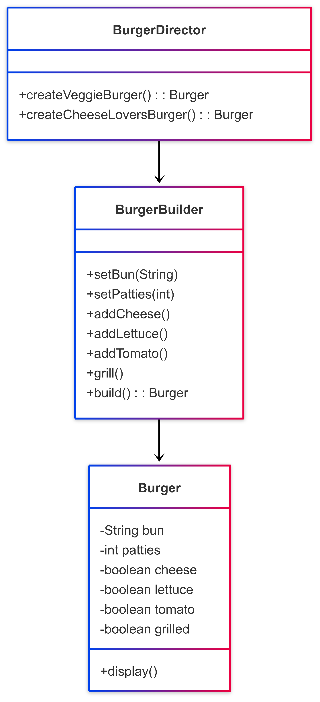

# 🍔 Builder Pattern

## 📘 Problem Statement

You’re building a food ordering app where users can customize a burger: choose bun type, number of patties, toppings, sauces, and whether they want it grilled or toasted.

Directly instantiating the `Burger` object using a constructor becomes messy and unreadable, especially as options grow. You risk telescoping constructors or scattered configuration code.

**How can you construct flexible and readable configurations of a complex object like `Burger`, step by step, without bloating the constructor?**

---

## ✅ Solution

The **Builder Pattern** separates the construction of a complex object from its representation.

1. Define a `BurgerBuilder` class with step-by-step methods like `setPatties()`, `addCheese()`, etc.
2. A `Director` class (optional) can define preset configurations (e.g., "Veggie Burger", "Double Cheese").
3. The final object (`Burger`) is assembled using only the selected configuration steps.
4. The builder ensures consistency and hides partial/incomplete object states from the client.

This improves readability, supports flexible configurations, and avoids constructor overload.

---

## 📊 Diagram

A class diagram illustrating the pattern is available below:

