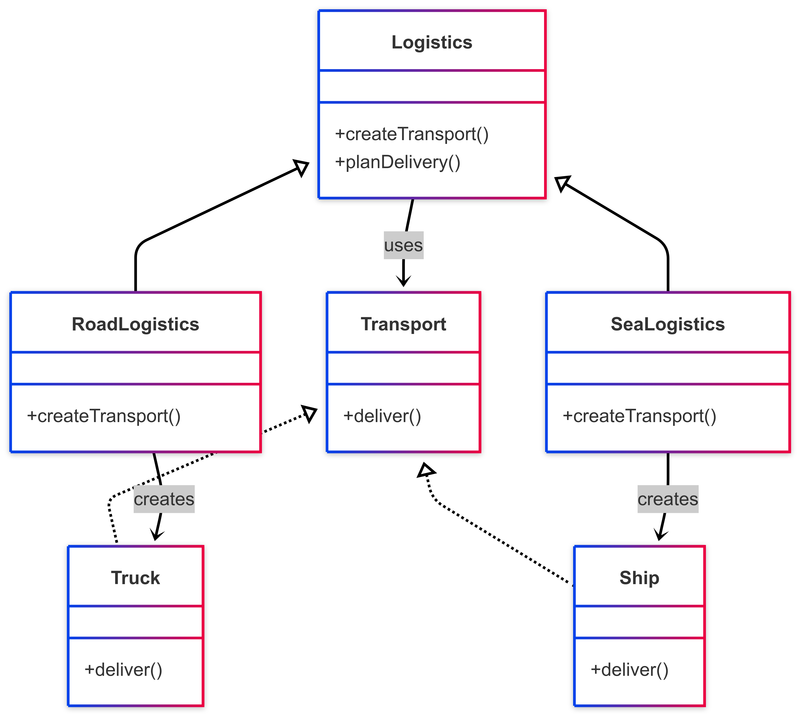

# 🏭 Factory Method Pattern

## 📘 Problem Statement

You are building a logistics management application that initially supports only truck-based delivery. Over time, customers request support for other transportation modes like ships or drones.

The existing system is tightly coupled to the `Truck` class, making it difficult to introduce new transport types without modifying existing code. This leads to code duplication, reduced maintainability, and potential bugs.

**How can you design the system to support multiple transport types without changing existing logic?**

---

## ✅ Solution

The Factory Method pattern addresses this by moving object creation out of the client code and into a separate method — the factory method.

You define a common product interface (`Transport`), with concrete implementations like `Truck` and `Ship`.  
An abstract creator class (`Logistics`) declares a factory method `createTransport()`, which subclasses (`RoadLogistics`, `SeaLogistics`) override to return specific products.

Client code interacts with the `Logistics` interface and is decoupled from specific transport implementations. New transport types can be introduced with minimal changes.

---

## 📊 Diagram

A class diagram illustrating the pattern is available below:

