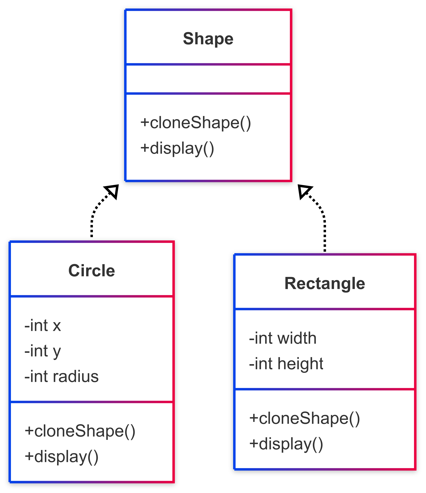

# 🧬 Prototype Pattern

## 📘 Problem Statement

You’re working with a library of preconfigured graphic shapes (`Circle`, `Rectangle`, etc.). You often need to generate multiple copies of these objects with the same properties — but instantiating each one from scratch is costly and error-prone, especially when configuration is complex.

You also don't want your code to depend directly on each shape's concrete class — you may receive them from a 3rd-party API or only interact with a generic `Shape` interface.

**How can you create copies of objects at runtime without relying on their specific classes?**

---

## ✅ Solution

The **Prototype Pattern** lets you **clone existing objects**, avoiding repetitive initialization and reducing coupling with concrete classes.

1. Define a common `clone()` method in a `Prototype` interface or base class.
2. Each subclass (e.g., `Circle`, `Rectangle`) implements its own version of `clone()` to return a deep copy.
3. Optional: Maintain a registry of preconfigured prototypes and use them as templates for cloning.

The result is a flexible and efficient cloning mechanism that promotes reuse and encapsulates configuration logic.

---

## 📊 Diagram

A class diagram illustrating the pattern is available below:

---

## 🧠 Special Notes & Comparisons

- **Prototype vs Builder**:  
  Builder constructs complex objects step by step. Prototype clones a fully built object instantly.

- **Prototype vs Factory Method**:  
  Factory creates *new* objects; Prototype creates *copies* of existing ones.

- Useful when:
    - Objects are expensive to create.
    - Initialization logic is complex or based on runtime data.
    - Concrete types are unknown (e.g., dynamic plugins or deserialized classes).

- Be cautious with **shallow vs deep copying** — complex objects with references should implement deep cloning to avoid unintended shared state.

