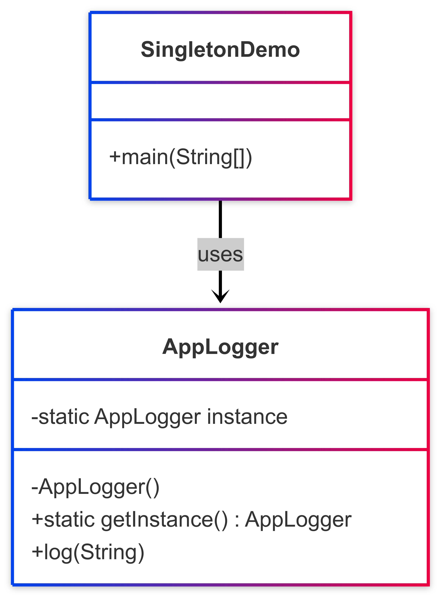

# 🔒 Singleton Pattern

## 📘 Problem Statement

Some parts of your application need **centralized, consistent access** to a single shared resource — such as a configuration manager, logging system, or database connector.

Using global variables is unsafe, and allowing multiple instances of the class could lead to inconsistent behavior, unexpected writes, or resource conflicts.

**How can you ensure that a class has only one instance across the entire app, while still allowing global access to it?**

---

## ✅ Solution

The **Singleton Pattern** ensures that:
1. A class has only one instance.
2. That instance is globally accessible through a static method.

To implement it:
- The constructor is made **private** to prevent direct instantiation.
- A static method (usually `getInstance()`) creates the instance lazily and returns the same reference each time it's called.
- Thread safety can be added if the app is multithreaded.

---

## 📊 Diagram

A class diagram illustrating the pattern is available below:

---

## 🧠 Special Notes & Comparisons

- **Singleton vs Global Variable**: Singleton offers global access but **enforces a single instance** and encapsulates state. Globals do not offer this protection.

- **Singleton vs Static Class**: Static classes have only static methods and can’t implement interfaces or be passed around. Singleton allows polymorphism and lazy initialization.

- **Multithreading Caveat**:  
  Ensure **thread safety** using synchronized blocks, double-checked locking, or using `enum` in Java (which guarantees single instance at JVM level).

- **Testing Challenge**:  
  Singleton can make unit testing harder, especially if it's tightly coupled. Consider injecting the singleton or refactoring it behind an interface.

- **Overuse Warning**:  
  Singleton can lead to hidden dependencies and tight coupling. Use only for **truly global and shared state**.
